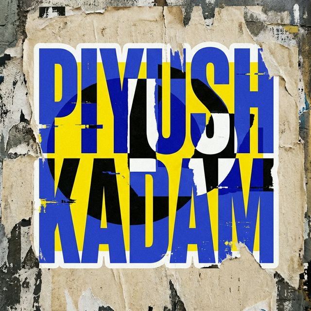

<h1 align="center">⚡ NeoBrutalist Portfolio ⚡</h1>

<p align="center">
  <b>A bold, unapologetic, brutalist-style personal portfolio website.</b><br>
  <i>Because the web has become too sanitized.</i>
</p>

## 🎯 About

**NeoBrutalist Portfolio** is a high-impact, visually striking personal portfolio built with raw HTML, CSS, and JavaScript. It embraces the **Neo-Brutalist** design philosophy — bold borders, hard shadows, loud colors, and zero compromise on personality.

> *"I build digital products that refuse to be boring."*

---

## 🖼️ Preview

<p align="center">
  
</p>

---

## ✨ Features

| Feature | Description |
|---------|-------------|
| 🎨 **NeoBrutalist Design** | Bold borders, hard shadows, vibrant colors, grid backgrounds |
| 🖱️ **Custom Cursor** | Interactive cursor with hover effects and blend modes |
| 📊 **GitHub Stats** | Live GitHub profile stats fetched via API |
| 💻 **LeetCode Stats** | Integrated LeetCode statistics display |
| 🛡️ **Admin Panel** | Password-protected config editor with localStorage persistence |
| 📱 **Responsive** | Optimized for all screen sizes |
| ⚡ **No Framework** | Pure HTML + CSS + JS — zero dependencies, lightning fast |
| 🎭 **Scroll Animations** | Reveal-on-scroll effects with IntersectionObserver |
| 🏃 **Marquee Ticker** | Animated scrolling text banners |
| 🔧 **Editable Config** | All content is configurable via the admin panel |

---

## 🗂️ Project Structure

```
NeoBrutalist/
├── 📄 index.html          # Main portfolio page
├── 📄 admin.html           # Admin panel (password: admin123)
├── 📄 README.md            # You are here!
└── 📁 Assets/
    └── 📁 images/
        ├── 🖼️ portfolio.png   # Profile avatar
        ├── 🖼️ title_icon.png  # Browser tab icon
        ├── 🖼️ stoceasy.png    # Project screenshot
        ├── 🖼️ aiva.png        # Project screenshot
        ├── 🖼️ resumeiq.png    # Project screenshot
        └── 🖼️ img.jpg         # Additional image
```

---

## 🚀 Getting Started
```bash
# On Windows
start index.html

# On macOS
open index.html

# On Linux
xdg-open index.html
```

### 3. Customize via Admin Panel

1. Open `admin.html` in your browser
2. Enter password: `admin1234`
3. Edit your name, bio, skills, projects, socials — everything!
4. Click **SAVE CONFIG**
5. Refresh `index.html` to see your changes

---

## 🎨 Design System

The portfolio uses a custom **NeoBrutalist** color palette:

| Color | Hex | Usage |
|-------|-----|-------|
| 🟡 **Neo Yellow** | `#FBFF48` | Primary accent, highlights |
| 🩷 **Neo Pink** | `#FF70A6` | Hover effects, links |
| 🔵 **Neo Blue** | `#3B82F6` | CTAs, buttons |
| 🟢 **Neo Green** | `#33FF57` | Status indicators, success |
| 🟣 **Neo Purple** | `#A855F7` | Secondary accent |
| 🟠 **Neo Orange** | `#FF9F1C` | LeetCode section, warnings |
| 🔴 **Neo Red** | `#FF2A2A` | Errors, danger |
| ⬛ **Neo Black** | `#121212` | Backgrounds, text |
| ⬜ **Neo White** | `#FFFDF5` | Light backgrounds |

**Typography:**
- **Display:** Space Grotesk (800 weight)
- **Mono:** JetBrains Mono (700 weight)

---

## 🛠️ Tech Stack

<p align="center">
  
  
  
  
  
</p>

---

## 📸 Sections

- **🏠 Hero** — Bold title, status badge, CTA buttons
- **👤 About** — Avatar, bio, highlights, location badge
- **💡 Skills** — Interactive grid with hover effects
- **📋 Experience** — Timeline with brutalist cards
- **📊 Coding Stats** — GitHub + LeetCode live stats
- **🗂️ Projects** — Showcase cards with tags and links
- **💬 Testimonials** — Auto-scrolling marquee reviews
- **📬 Contact** — Contact form + email + location
- **🔗 Footer** — Social links + sitemap

---

## ⚙️ Configuration

All website content is stored in **localStorage** and can be edited through the admin panel. The configurable sections include:

- **Identity** — Name, title, tagline, email, location, avatar
- **Social** — GitHub, LinkedIn, Instagram URLs
- **About** — Bio, highlights
- **Skills** — Name, type, color for each skill
- **Experience** — Role, company, period, description
- **Projects** — Title, description, tags, link, image
- **Testimonials** — Text, author, role

---

## 📄 License

This project is open source and available under the [MIT License](LICENSE).

---

## 👨‍💻 Author

<p align="center">
  
</p>

<h3 align="center">Piyush Kadam</h3>

<p align="center">
  <b>Full Stack Developer</b><br>
  <i>Pune, India 🇮🇳</i>
</p>

<p align="center">
  <a href="https://github.com/piyushkadam96k"></a>
  <a href="https://linkedin.com/in/piyushkadam96k"></a>
  <a href="https://instagram.com/piyushkadam96k"></a>
</p>

<p align="center">
  📧 <b>kadamamit462@gmail.com</b>
</p>

---

<p align="center">
  <b>⚡ Built with raw code, bold design, and zero apologies. ⚡</b>
</p>

<p align="center">
  
  
</p>

<p align="center">
  ⭐ <i>If you like this project, give it a star!</i> ⭐
</p>

